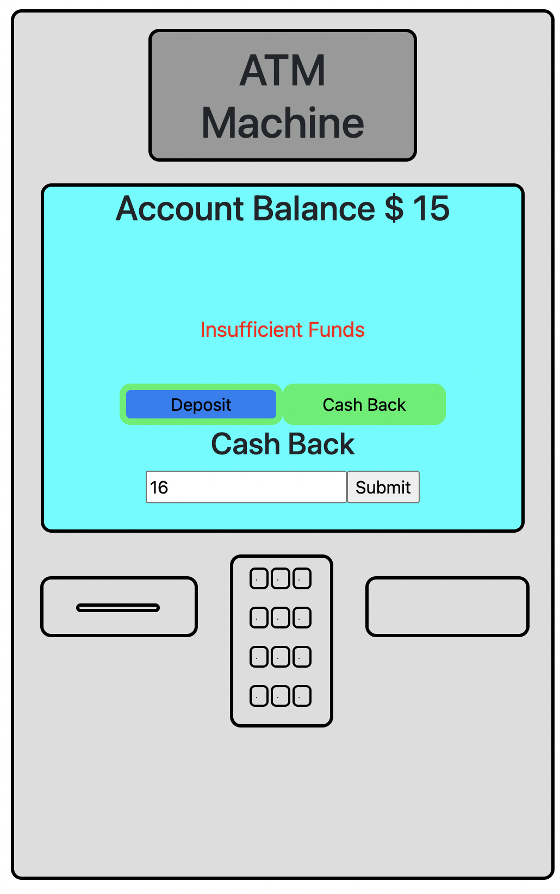

# ATM Machine simulation created with React

## This is a fun React app that allows you to select amounts to deposit and withdraw with built-in validation

#### How to run: 
- clone this repository / download it to your computer
- the app is running on React CDN so no need to instal node modules!
- if you don't have http-server installed open the command line
- npm install -- global hhtp-server
- cd into the folder with this project 
- http-server -c-1
- navigate to http://localhost:8080/ in your browser
- select either "Deposit" or "Cash Back"
- click submit

#### This app was created as a part of the MITxPro Professional Certificate in Coding course with specific instructions on how to build it. My contributions were: 
- The overall graphic design to make it look like an ATM Machine
- Buttons change color based on selection
- Transaction validation for various scenarios such as an overdraft, or a negative withdrawal

### Future Improvements
Fix the design so that it doesn't jump when a validation message shows up

MIT License 
